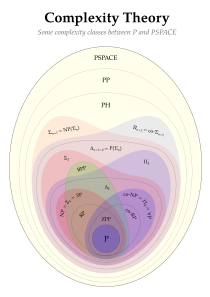
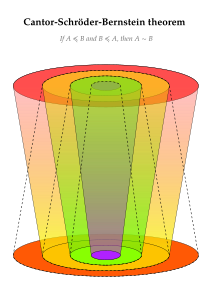
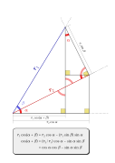
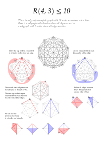
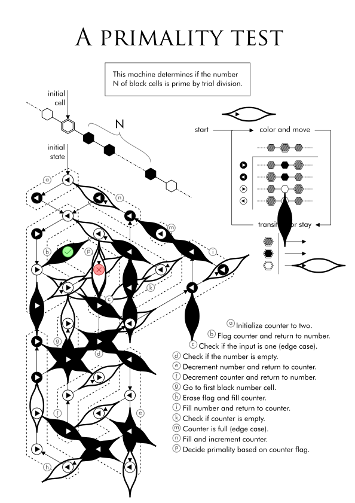

Illustrations
=============
This is a collection of primarily vector illustrations of mathematical topics.
There are also some interactive ones [here](interactive). If you want to use or
redistribute them, please send me an email. 

Showcase
--------

