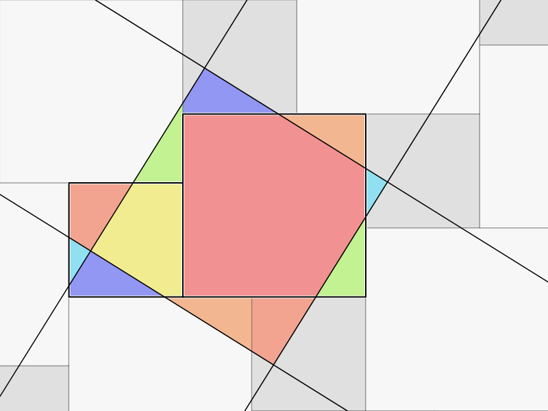
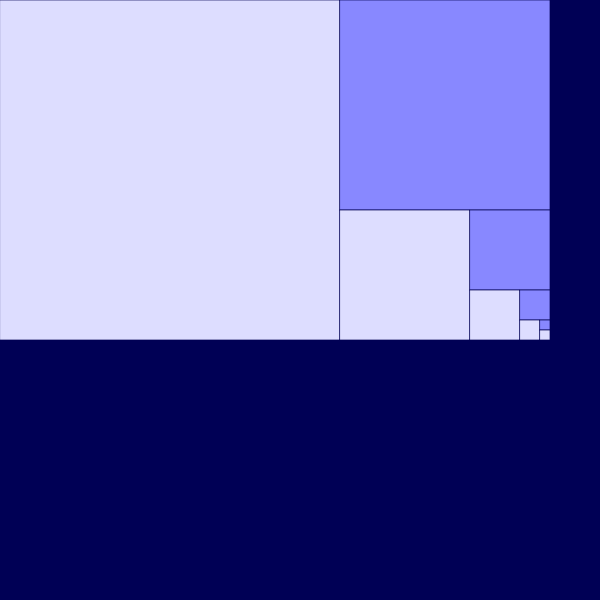

# Interactive visualizations

This is a collection of interactive visualizations.

## [The Pythagorean theorem](Pythagorean_theorem.html)

This is a visualization of a proof discovered by the Persion mathematician 
Al-Nayrizi. The proof is based on superimposing lattices.

## [The Euclidean algorithm](Euclidean_algorithm.html)

This is a geometric interpretation of the Euclidean algorithm.
Use the arrow keys to change the input numbers.
